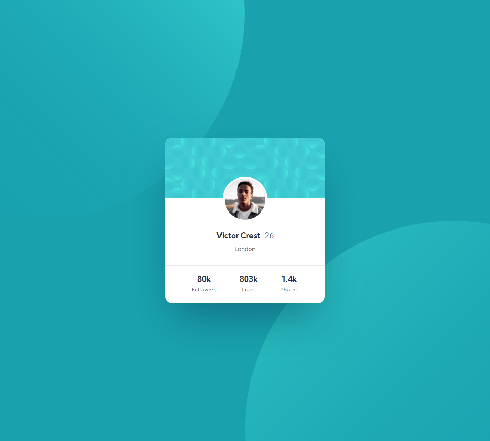
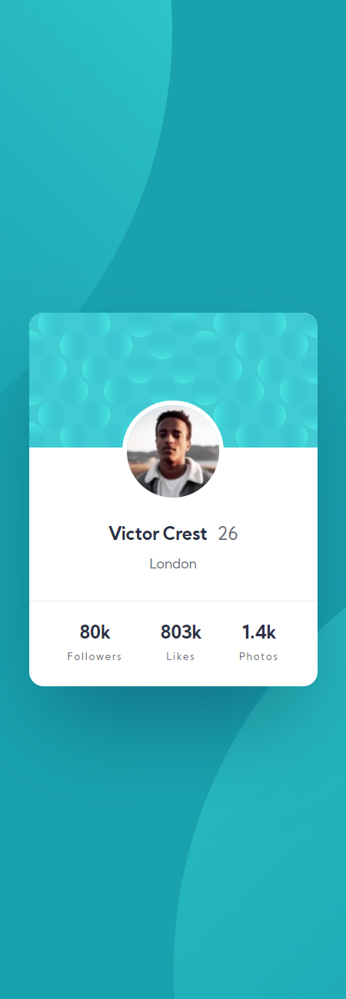

# Frontend Mentor - Profile card component solution

This is a solution to the [Profile card component challenge on Frontend Mentor](https://www.frontendmentor.io/challenges/profile-card-component-cfArpWshJ). Frontend Mentor challenges help you improve your coding skills by building realistic projects.

## Table of contents

- [Overview](#overview)
  - [The challenge](#the-challenge)
  - [Screenshot](#screenshot)
  - [Links](#links)
- [My process](#my-process)
  - [Built with](#built-with)
  - [What I learned](#what-i-learned)
- [Author](#author)

## Overview

### The challenge

Users should be able to:

- Build out the project to the designs provided

### Screenshot




### Links

- Solution URL: (https://www.frontendmentor.io/solutions/responsive-profile-card-d5wUVm3-A)
- Live Site URL: (https://lm-profile-card.netlify.app/)

## My process

### Built with

- Semantic HTML5 markup
- CSS custom properties/vars
- Desktop-first workflow

### What I learned

I made a slight border around the profile card image for the first time. At first I tried going with a padding and background approach.

```css
.card-profile-img {
  background: #fff;
  padding: 5px;
}
```

I found out quick enough this did not work, and found out that I completely overcomplicated it and could've used a border - this did mean I had to remove the block display which I was using to center the img, but that was fixed by making the main content of the card a flexbox layout vertically.

```css
.card-profile-img {
  border: 5px solid #fff;
}
```

## Author

- Website - [Leon Michalak](https://www.leonmichalak.tech)
- Frontend Mentor - [@NinjaInShade](https://www.frontendmentor.io/profile/NinjaInShade)
- Instagram - [@lmdeveloper](https://www.instagram.com/lmdeveloper/)
